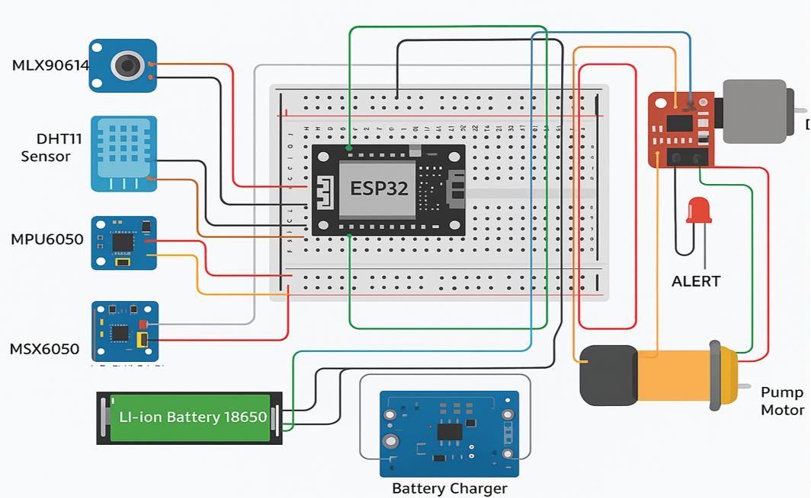
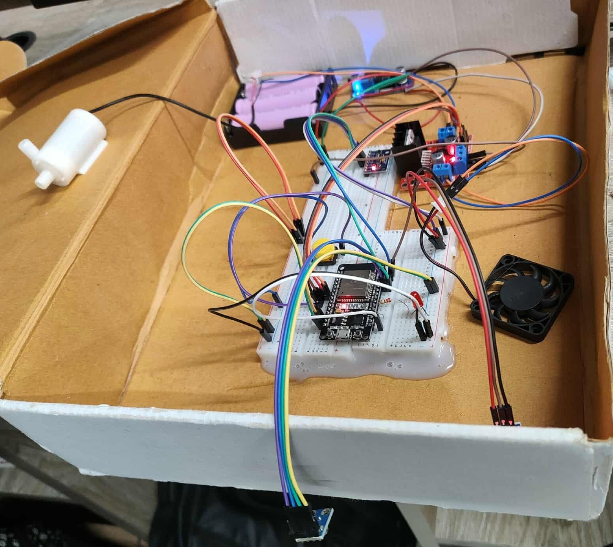

# Autonomous Heat Stroke Detection and Response Robot

## Overview
Heat stroke is a severe health condition caused by the body's inability to regulate temperature in hot and humid environments. This project introduces an autonomous robot designed to monitor human body temperature, environmental conditions, and movement patterns to identify heat stroke risks. Upon detecting danger, the system automatically intervenes by activating a cooling fan, spraying water mist, illuminating an LED alert, and dispatching Wi-Fi notifications.

For full documentation, theoretical background, and detailed test results, please refer to the primary project document: [Final Project Report](Final%20Project%20Report%20CSE461%20Robotics_%20Section%202_Group%205.pdf).

## Features
*   **Environment Monitoring:** Continuously tracks ambient temperature and humidity.
*   **Non-Contact Body Temperature Sensing:** Measures human body temperature safely and accurately without physical contact.
*   **Motion and Posture Tracking:** Detects prolonged stillness or fainting associated with heat exhaustion.
*   **Automated Cooling Response:** Activates a DC fan and a mist-spraying water pump when specific thresholds are breached.
*   **Alert System:** Triggers visible LED warnings and sends emergency Wi-Fi notifications to nearby authorities or monitoring systems.
*   **Energy Efficient:** Sensors operate at intervals and cooling systems only activate during critical risk events to conserve power.

## Hardware Components
*   ESP32 Development Board (Microcontroller)
*   GY-906 / MLX90614 (Infrared Body Temperature Sensor)
*   DHT11 (Ambient Temperature and Humidity Sensor)
*   MPU-6050 (Gyroscope and Accelerometer Module)
*   L298N Dual H-Bridge Motor Driver
*   JD-4007S5L2 Brushless DC Fan (5V, 0.08A)
*   DC Water Pump Motor
*   Battery Pack: 3x 18650 Li-Ion Batteries (3.7V, 7800mAh each) with CA2596 DC-DC Buck Converter
*   TG-008 Li-Ion Battery Charger
*   Standard Electronic Components: Breadboards, Jumper Wires, Push Button, 220-ohm Resistor, LED

## Software and Tools
*   Arduino IDE
*   ESP32 Board Package
*   Libraries: `Adafruit_MLX90614`, `DHT sensor library`, `Adafruit_MPU6050`, `WiFi.h`

## System Architecture and Workflow
1.  **Initialization:** The system is powered on and monitoring begins via a push button.
2.  **Data Collection:** The ESP32 continuously reads data from the DHT11, MLX90614, and MPU6050 sensors.
3.  **Risk Analysis & Actuation:** 
    *   If the ambient temperature is > 35 degrees Celsius with high humidity, the cooling fan is activated.
    *   If body temperature exceeds 40 degrees Celsius in a hot environment, the fan activates and a Wi-Fi alert is dispatched.
    *   If prolonged stillness is detected (indicating possible unconsciousness), the LED turns on and a Wi-Fi alert is sent.
    *   If all critical thresholds are met (Heat Stroke Risk), the fan, water pump, LED, and Wi-Fi alerts are activated simultaneously.
4.  **Standby:** If conditions normalize, the cooling mechanisms power down, returning to a monitoring state.

## Circuit and Project Images

## Challenges Addressed
*   **Sensor Accuracy:** Overcame DHT11 fluctuations by averaging multiple readings over time.
*   **Motor Power:** Utilized an L298N motor driver with a dedicated power supply to handle the higher current requirements of the fan and water pump.
*   **Motion Data Noise:** Applied a time-based threshold system to the MPU6050 to prevent false alarms from sudden, random movements.
*   **Water Splash Risk:** Designed basic casing to isolate the water pump and misting system, protecting the ESP32 and motor driver from short circuits.

## Future Scope
*   Integration of advanced sensors such as thermal cameras, pulse rate monitors, and oxygen level trackers.
*   Addition of smart mobility (wheels) for autonomous navigation to reach affected individuals.
*   Implementation of edge computing for real-time thermal mapping and 5G connectivity for remote operation.
*   Solar panel integration to create a more sustainable, self-sufficient energy loop.

## Contributors
Developed by students of BRAC University (Department of Computer Science and Engineering)
